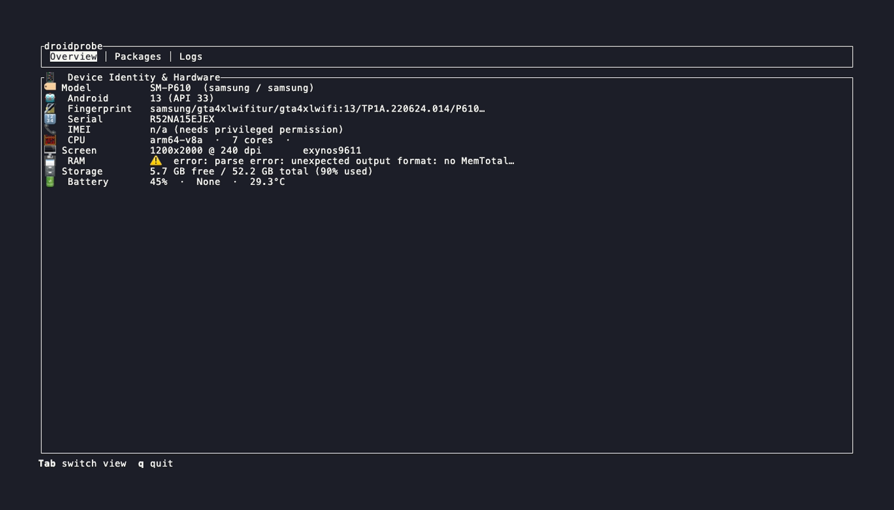
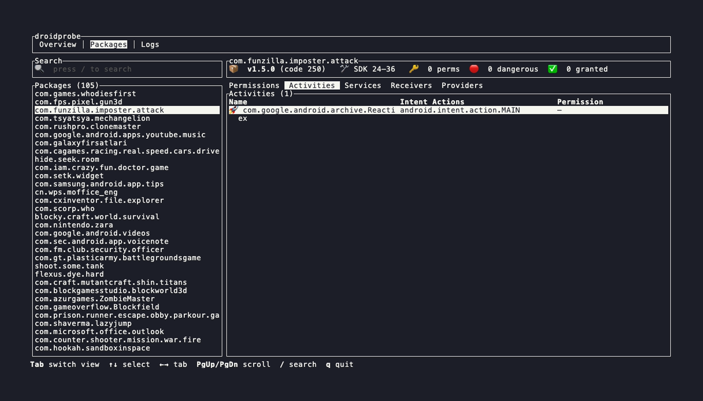
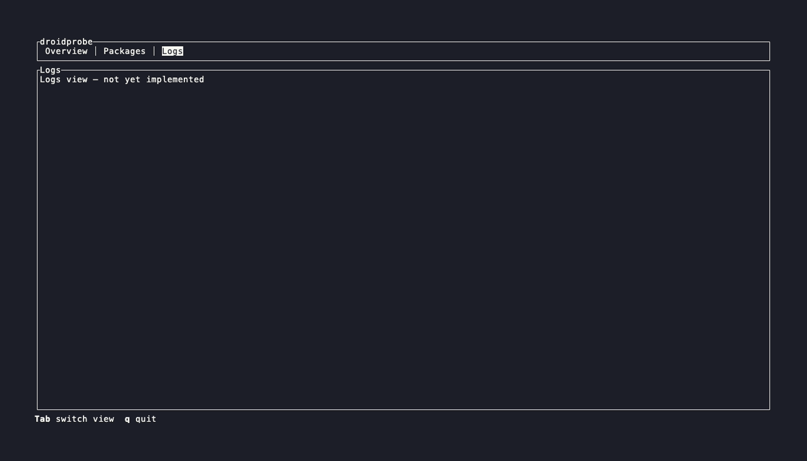

# droidprobe

Modular Rust toolkit for inspecting an Android device over ADB (USB debugging).
One shared core powers two front-ends: a terminal UI (`droidprobe`) and an MCP
server (`droidprobe-mcp`) for agents.

See [ARCHITECTURE.md](./ARCHITECTURE.md) for the full design and phased plan.

## Screenshots


| Overview | Packages | Logs |
| --- | --- | --- |
|  |  |  |

## Workspace layout

```
droidprobe/
├── Cargo.toml                      # workspace + shared dep versions
├── ARCHITECTURE.md
└── crates/
    ├── droidprobe-parser/   # raw text -> structured data (pure, no I/O)
    ├── droidprobe-command/  # Command trait, Transport, built-in catalog
    ├── droidprobe-core/     # Registry + Engine + Poller
    ├── droidprobe-tui/      # ratatui binary  (bin: `droidprobe`)
    └── droidprobe-mcp/      # rmcp binary     (bin: `droidprobe-mcp`)
```

## Prerequisites

- Rust 1.82+ (`rustup` recommended)
- A running `adb` server (`adb start-server`) and a device with USB debugging
  enabled and authorized.

## Build & test

```bash
cargo build --workspace
cargo test  --workspace        # parser + command tests run without a device
```

## Run the TUI

```bash
cargo run -p droidprobe-tui
# Tab switches views, q quits. Logs are written to ./droidprobe.log
```

## Run the MCP server

```bash
cargo run -p droidprobe-mcp        # speaks MCP over stdio
```

Register it with an MCP client (e.g. Claude Desktop / Claude Code) by pointing
the client at the built binary as a stdio server. Tools are **read-only**.

## Adding your own command

Implement `Command`, wrap it in `TypedDyn`, and register it:

```rust
let mut registry = droidprobe_core::registry::Registry::with_builtins();
registry.register(Box::new(droidprobe_command::TypedDyn(MyCommand)));
```

## Status

Phase 1 (foundation) is scaffolded: 4 tested parsers, 5 built-in commands, the
registry/engine/poller, a working overview TUI view, and a 5-tool MCP server.
Phases 2–6 (parser breadth, TUI depth, ATK command parity, MCP polish,
robustness) are described in ARCHITECTURE.md.

## License

MIT OR Apache-2.0
